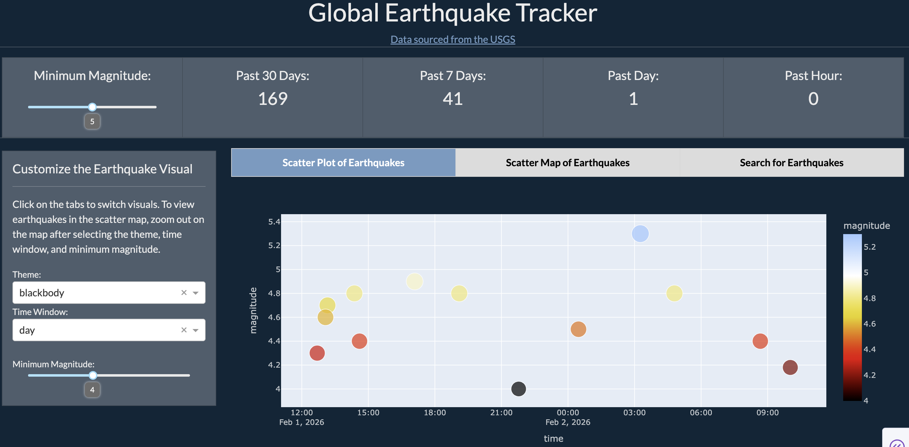
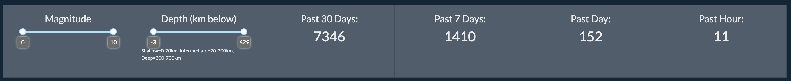
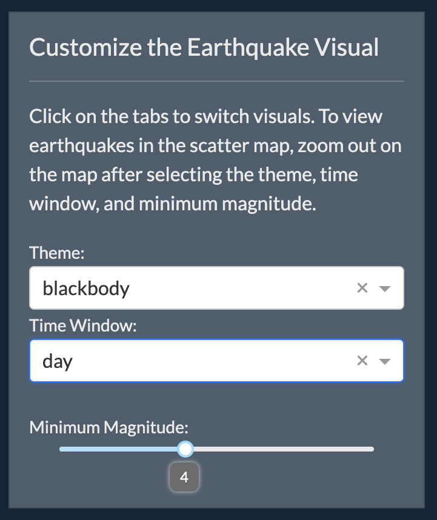
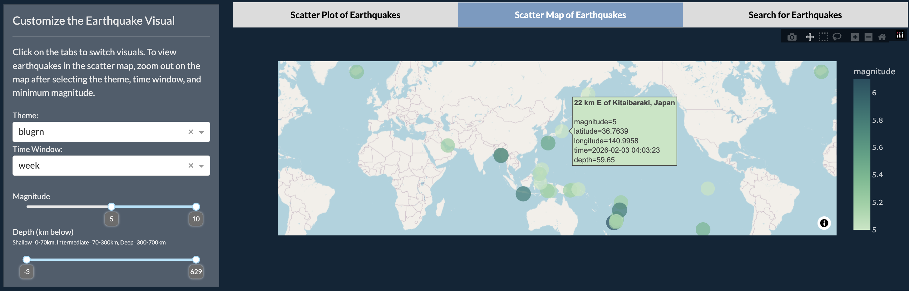
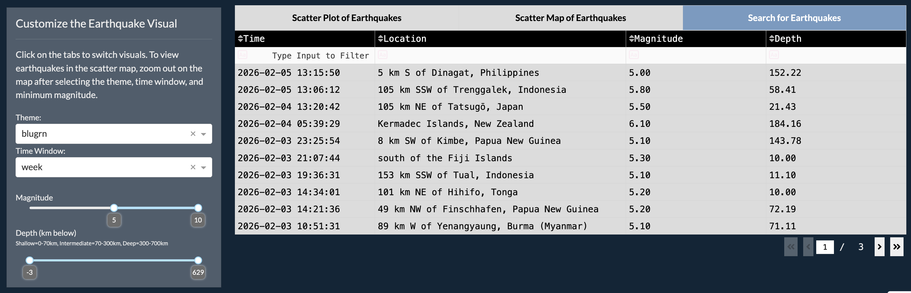

# Global Earthquake Tracker Dashboard
This is a near live earthquake tracker made using Plotly Dash and an API sourced from the <a href="https://earthquake.usgs.gov/earthquakes/feed/v1.0/geojson.php">United States Geological Survey (USGS)</a>.

## Project Features
### Earthquake Counter 
There is an earthquake counter spanning the top of the page, providing earthquake counts for the last hour, day, week, month within a chosen magnitude and depth range.

### Customization Panel
On the left side of the app below the Earthquake Counter is a panel to customize the visualizations on the right side. Feature selection includes colour theme, time window (earthquakes within the past hour, day, week, month), and a slider to adjust the magnitude and depth range.

### Visualizations
The visualizations in this dashboard are a scatter plot, scatter map, and search table. These visualizations are located within the tabs on the dashboard.

### Technologies and Features Implemented
I was interested in being able to implement an API to create a more dynamic and interactive project that can be used to gather ever-changing insights. This earthquake tracker is user-driven, so it allows for users to gather specific information they are interested in.

In the future, I hope to implement more detailed information about earthquake events such as further statistical insights and visualizations that can filter by country. 

## How to Install and Run the Project
1. Clone the repository.
2. Set up a Python virtual environment.
3. Install the packages listed in requirements.txt.
4. Run the app. The app will start a local server which allows for the dashboard to be viewed.

## How to Use the Project
### Earthquake Counter 
 The earthquake counter can be customized to be based on a specified magnitude range (from 0 to 10) and depth range (from the most shallow and most deep depth in the past month). After selecting a minimum and maximum magnitude and depth range, the earthquake counter will update to count earthquakes within the selected range.

 

### Customization Panel
The Customization Panel is used to customize the visualizations. The properties that can be customized using this panel are the colour theme for the visualizations (affects the scatter plot and scatter map only), time window (earthquakes within the last hour, day, week, month), magnitude range (from 0 to 10), and depth range (from the most shallow and most deep depth in the past month). This panel is not used for the Earthquake Counter and is used only for the visualizations within the 3 tabs.

 

### Visualizations
The visualizations are located within the 3 tabs (Scatter Plot of Earthquakes, Scatter Map of Earthquakes, Search for Earthquakes) in the dashboard. Click on each tab to view the visualizations. 

Scatter Plot:
The scatter plot graphs earthquake events by time and magnitude. The earthquake events shown can be controlled by the time and magnitude range set in the Customization Panel.

Scatter Map:
The scatter map plots earthquake events on a world map using longitude and latitude data, to identify the location of the earthquake globally. The earthquake events shown can be controlled by the time and magnitude range set in the Customization Panel.

Search Table:
The search table allows for earthquakes events to be filtered/searched by time, location, and magnitude. Similarly to the scatter plot and map, the initial data in the table can be controlled by the customization panel. The table allows for more precise searching of earthquakes such as for occurences in a specific country, date/time, and magnitude.

### License

